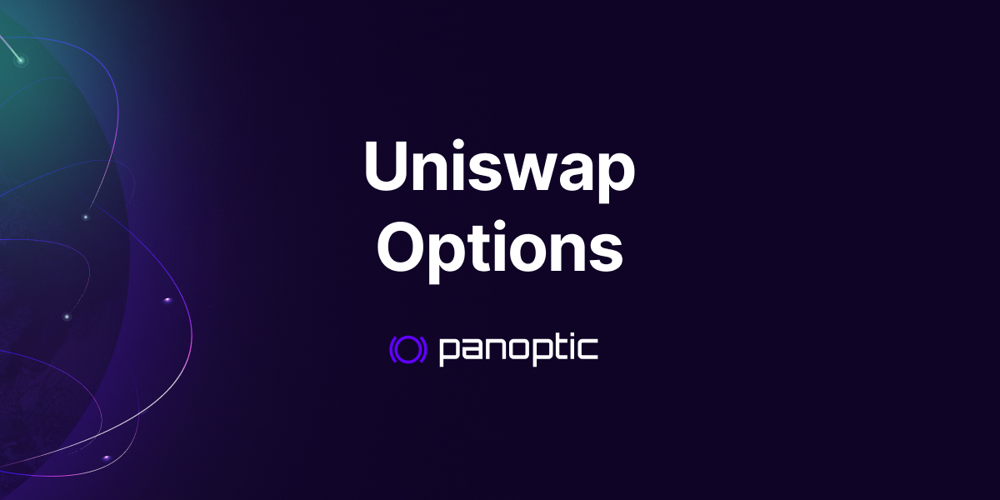

Options trading is an important part of the financial markets, allowing traders to take advantage of price movements and hedge their investments. In traditional finance (TradFi), the options market commands more capital than equities. The same is not true for decentralized finance (DeFi). 

 
Two years ago, the innovation of Uniswap v3 opened a door for new option trading opportunities. Today, with dozens of concentrated liquidity market makers (CLMMs) being built, DeFi is on the verge of an options trading revolution — and Panoptic is at the heart of it.

<!--truncate-->

## **How Uniswap v3 Enabled Options Trading**

[Uniswap v3](https://uniswap.org/) made its debut in May 2021, introducing a host of innovative features including concentrated liquidity, paving the way for CLMMs.

Unlike traditional liquidity provisioning (LPing), which spreads liquidity across a token pair's entire price spectrum, concentrated liquidity empowers liquidity providers (LPs) to contribute their assets within a specified price range.

By concentrating liquidity within a defined price range, LPs effectively created a range-bound exposure. This means that their potential gains and losses inside and outside of that specific range [are similar to options payoffs](https://twitter.com/Panoptic_xyz/status/1646917853755604993?s=20) with defined [strike prices](https://twitter.com/Panoptic_xyz/status/1646917857362718720?s=20) and an [effective time to expiration](https://twitter.com/Panoptic_xyz/status/1641108075833884673?s=20).

In short, the CLMM on Uniswap v3 enabled LPs to sell put options and, in exchange, continually receive fees from spot traders as their “streamia” (streaming premia) — a Panoptic discovery.  

## **Options Trading Limitation on Uniswap v3**

While concentrated liquidity made selling put options possible, Uniswap v3 wasn’t designed to address the gap in DeFi’s options trading market. 

Despite its innovative nature, the platform lacks the ability to create various positions experienced options traders are accustomed to including advanced strategies such as strangles and straddles. The inability to lend and borrow Uniswap v3 LP tokens makes it impossible to buy puts and calls. 

Overall, Uniswap options are limited and fall short in terms of capital efficient options trading.

## **How Uniswap v3 Empowers Panoptic’s Oracle-Free Protocol**

Our protocol builds on top of Uniswap v3's innovation and introduces several cutting-edge features to deliver a seamless options trading experience to DeFi.
 
First, our platform creates a market for borrowing and lending Uniswap v3 LP tokens, enabling both long and short options trading. Traders can now buy and sell both put and call options for any token on Uniswap, the world's largest decentralized exchange (DEX).

Panoptic eliminates counterparties, such as market makers, from pricing options and replaces pricing with a spot-market based streamia which converges to [Black-Scholes pricing](https://paper.panoptic.xyz/). The Panoptic streamia is a zero-upfront, pay-as-you-go streaming premia which utilizes Uniswap's fee collection to calculate the streamia owed by the option buyer to the seller.

The streamia is equal to the amount of swap fees the borrowed Uniswap LP token would have earned in the Uniswap pool had it not been removed by the buyer plus an additional Panoptic liquidity spread. Thus, Panoptic options sellers earn better returns than LPing in Uniswap for the same positions.

Moreover, [Panoptic liquidity provides](https://docs.panoptic.xyz/docs/panoptic-protocol/protocol-roles#panoptic-liquidity-providers-plps) (PLPs) play a similar role to traditional LPs by providing liquidity to facilitate trades. However, on Panoptic, PLPs do not need to choose a price range and can supply either one or two tokens in any ratio. This opens up single-sided and brings back fungible LPing, allowing passive investors to participate in the market again. 

Our PLPs earn rewards proportional to the amount of options trading volume in Panoptic without having to worry about price exposure or impermanent loss!

Additionally, PLPs allow users to trade undercollateralized options. While undercollateralized positions come with increased risk and require close monitoring, users can amplify their exposure while freeing up capital.

Finally, our collateral tracker allows traders to mint [capital-efficient](https://research.panoptic.xyz/p/whats-the-most-capital-efficient), multi-legged positions such as straddles, strangles, iron condors and more. Through Panoptic, both advanced options traders and newcomers can leverage their positions and manage their DeFi investment risks effectively.

## **The Future of Options in DeFi**

With the expiration of Uniswap's business license this past April, [other decentralized exchanges have forked its code](https://twitter.com/Panoptic_xyz/status/1646917783144517632?s=20) and implemented CLMMs on their platforms. DEXes already utilizing the fork include PancakeSwap, SushiSwap, QuickSwap, and more.

In theory, Panoptic can integrate with any exchange that utilizes CLMMs, not just Uniswap, which means that in due course, Panoptic will be integrated on top of additional DEXes, enabling everyone to manage portfolio risk, earn sustainable returns, and trade options across the entire space!

Join the growing community of Panoptians and be the first to hear our latest updates by following us on our [social media platforms](https://links.panoptic.xyz/all). To learn more about Panoptic and all things DeFi options, check out our [docs](https://panoptic.xyz/docs/intro) and head to our [website](https://panoptic.xyz/).