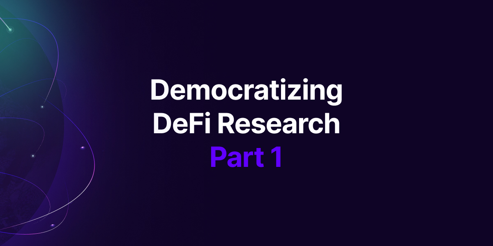

In this inaugural article of our three-part Democratizing DeFi Research series, we provide a guide on how to access, understand, and run our open-source code. More specifically, you will learn to:

1. Access Panoptic's open-source research notebooks and code on GitHub
2. Download and run Python code and Jupyter Notebooks

<!--truncate-->

Note: basic coding knowledge is a beneficial prerequisite for achieving both of these objectives.

---

##  **Why Panoptic Research**

Panoptic Research, [launched](https://panoptic.xyz/blog/panoptic-defi-options-research-launch) earlier this year, is a tool to help you navigate the dynamic world of Decentralized Finance (DeFi), options, and blockchain technology.

This program is vital in driving innovation, encouraging open dialogue, and upholding our commitment to transparency.

When it comes to the open-sourcing of our research, we are guided by three primary objectives:

1. **Validation**: We believe in robust verification of our work and invite peer scrutiny for ensuring the quality and reliability of our research.

2. **Participation**: Encouraging community engagement is key to our mission. By open sourcing our research, we seek to stimulate dynamic conversations and promote collaborative efforts.

3. **Innovation**: We envision our open-source initiative as a hotbed of innovation. We hope that by providing access to our work, we can inspire novel ideas and groundbreaking advancements in DeFi, options, and blockchain technology.

In line with these objectives, we launched the Panoptic Research Bites program. Our research bites are a publicly accessible, composable, and free-to-use collection of [research analysis](https://panoptic.xyz/research) with corresponding code hosted on our [GitHub repository](https://github.com/panoptic-labs/research).

We've opted to use GitHub for Panoptic Research because it aligns with our values of transparency, collaboration, and reproducibility. It enables us to share our code openly, receive feedback from the community, and allow others to build upon our work.

As we navigate this digital frontier, we invite you to learn more about our research, methodologies, and insights on GitHub.

## **Access Our Code and Notebooks **

Achieving our first objective is simple. Access our GitHub repository by clicking [here](https://github.com/panoptic-labs/research).

We continuously add new content. To get notifications of these updates, click the Star in the top-right corner of the page.

### **Overview of the repository structure**

Our repository is organized into different sections to provide clarity.

1. "[_research-bites](https://github.com/panoptic-labs/research/tree/main/_research-bites)": Here, you’ll find the code associated with our research bites organized by date. These include Jupyter Notebooks and Python scripts that can be viewed, run, or modified to further explore our research findings.

2. "[_research-bites/_tutorials](https://github.com/panoptic-labs/research/tree/main/_research-bites/_tutorials)": This is where we host more comprehensive guides on general topics such as data fetching.

3. "[stylesheet](https://github.com/panoptic-labs/research/tree/main/stylesheet)": Here, we create dark-mode, Panoptic-themed charts.

## **Downloading and Running a Code Sample**

To clone the entire repository, follow the steps outlined [here](https://docs.github.com/en/repositories/creating-and-managing-repositories/cloning-a-repository).

### **Downloading Individual Files**

To download individual files, simply navigate to the file in the repository, click on it, and then click the "Raw" button. Right-click anywhere on the page and choose "Save as" to download the file.

### **Required software**

To run the code, you'll need:

1. Python. Our code is primarily written in Python. You can download it from the [official Python website](https://www.python.org/downloads/).

2. Jupyter Notebooks: This is an open-source web application that allows you to create and share documents that include live code, equations, and other multimedia resources. It can be installed locally as part of the Python Anaconda distribution or standalone using pip: `pip install notebook`. If you're looking for a cloud-based, interactive solution, [Google Colab](https://www.geeksforgeeks.org/how-to-use-google-colab/) is a good option.

3. Required Libraries: Each code file or Jupyter Notebook will specify the required Python libraries at the top. These can typically be installed with pip: `pip install library-name`.

### **Running a piece of code or notebook**

If you want to run a .py file, read this step-by-step guide on [how to run a Python script](https://pythonbasics.org/execute-python-scripts/).

If you want to run a .ipynb file, read this step-by-step guide on [how to run a Jupyter notebook](https://docs.jupyter.org/en/latest/running.html).

**Upcoming Articles in the Series**

In our next posts, we'll take an in-depth look at [implied volatility on Uniswap](https://panoptic.xyz/research/democratizing-defi-options-research-implied-volatility) followed by a deep dive into the [Panoption backtester](https://panoptic.xyz/research/democratizing-defi-options-research-backtest).

Join the growing community of Panoptians and be the first to hear our latest updates by following us on our [social media platforms](https://links.panoptic.xyz/all). To learn more about Panoptic and all things DeFi options, check out our [docs](https://panoptic.xyz/docs/intro) and head to our [website](https://panoptic.xyz/).  

---

**Disclaimer**: This is never financial advice, and you must do your own research at all times (DYOR). This content is provided free of charge and solely for educational reasons.

