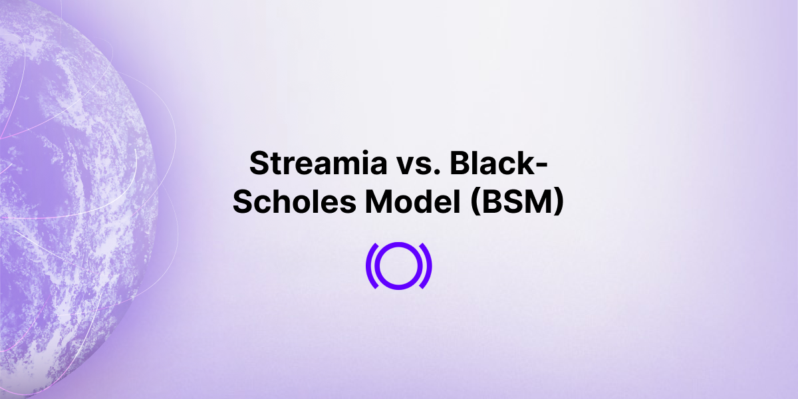
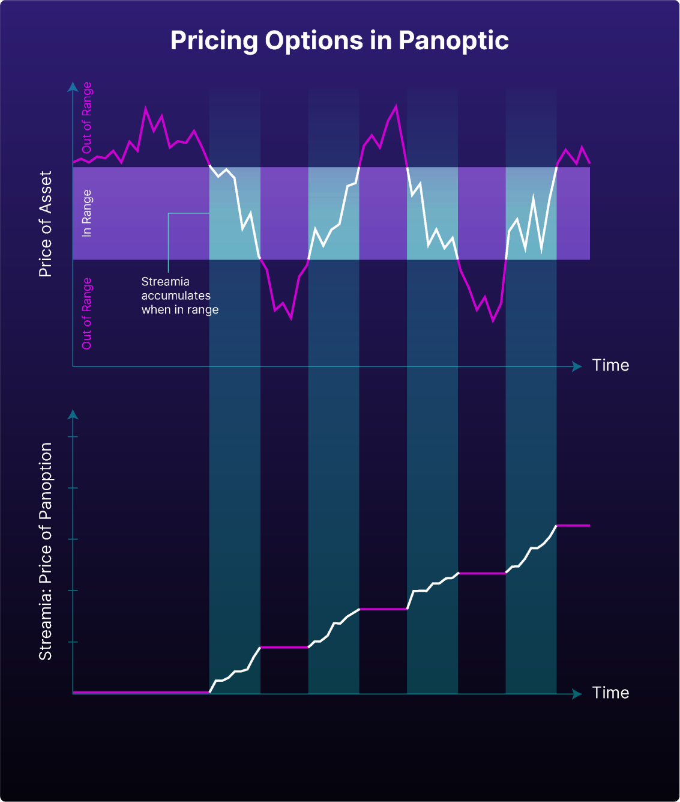

As a pioneering force in the options industry, Panoptic has introduced a new pricing model called streamia. Our groundbreaking approach aims to revolutionize decentralized finance (DeFi) options trading by introducing an innovative pricing model for a new type of financial instrument — perpetual options.

<!--truncate-->

Perpetual options fall outside the scope of the traditional options pricing model, the Black Scholes Model (BSM). To truly understand the advantages and potential implications of streamia compared to BSM, it’s important to understand what streamia is and the key differences between the pricing models.

  

## Understanding Streamia

  

Streamia is a combination of streaming and premia. Streaming refers to the continuous flow of payments made to hold a perpetual product, and premia refers to the price paid for the right, but not obligation, to trade an asset at a guaranteed price.

  

Our streamia model is a new way of pricing a new type of option — perpetual options. Unlike traditional options where buyers pay an upfront option premium, streamia allows for dynamic premia payments. Instead of an upfront payment, a position accumulates premia as long as it remains within a specified range.

  

Perpetual options can be compared to a continuous series of options that expire over a short period of time with the total premia gradually accumulating each time the option is [rolled](https://www.tastylive.com/definitions/rolling-options). The calculation of the premia in the streamia model takes into account factors such as the position’s price range, the corresponding Uniswap pool's liquidity and volume, and the Panoptic pool’s available liquidity. Our model is designed to converge to the BSM price of an option.

  

## Understanding BSM

  

The BSM is a popular formula for pricing options. Developed by economists Fischer Black and Myron Scholes in collaboration with mathematician Robert C. Merton, it revolutionized the options industry in 1973. BSM calculates the fair value of options based on factors such as the underlying asset price, time to expiration, strike price, risk-free interest rate, and volatility.

  

The BSM is widely used in options pricing and has shaped the development of financial derivatives markets. Traders, investors, and financial institutions rely on it to estimate the fair value of options and make informed trading decisions. However, it has limitations, such as the assumptions of constant volatility, that the underlying asset’s price follows a [geometric Brownian motion](https://panoptic.xyz/docs/trading/basic-concepts#how-are-options-typically-priced), and that the option can only be exercised at expiry.

  

## Shortcomings of BSM in DeFi

  

The BSM was made for expiring options in traditional finance, yet most DeFi options protocols rely on it for pricing today. This introduces several problems and limitations.

  

In order to make the BSM work on chain, protocols have to rely on external oracles to pull data as inputs into the pricing model such as the underlying asset’s price and volatility. Oracles can present their own problems of centralization, dependency, and manipulation. In general, using the BSM means more mathematical calculations are done on chain which can increase gas costs for users.

  

The BSM makes it harder to create a decentralized infrastructure that other protocols can build on in DeFi since the model introduces so many dependencies. Additionally, certain assumptions have to be made about the inputs into the BSM such as what the risk-free interest rate should be.

  

## The Benefits of Streamia in DeFi

  

Unlike the BSM, streamia is DeFi native. This means it works efficiently on chain to price perpetual options for all assets.

  

In addition, streamia introduces several distinct advantages:

  

### Accessibility and Affordability

  

Streamia eliminates the barrier to entry posed by upfront premia payments making options trading more accessible to a wider range of participants.

  

### Risk Management

  

The gradual accrual of fees in streamia enables more predictable risk management. Unlike margin trading on perpetual futures (perps) where positions can be quickly liquidated, streamia prevents traders from being liquidated by single-wick price movements and allows traders to effectively respond to changing market conditions.

  

### Capital Efficiency and Strategic Possibilities

  

The absence of an upfront payment in the streamia model enables traders to create positions at a fraction of the cost of traditional options. Capital efficiency in Panoptic is further enhanced through the ability to trade multi-legged positions in one transaction, expanding strategic possibilities and empowering traders to explore new avenues.

  

### Robustness and Gas Efficiency

  

Streamia operates entirely on chain, eliminating the reliance on external oracles for pricing. This robustness guards against oracle dependencies and potential manipulation. Furthermore, by eliminating the need for oracle synchronization costs, streamia achieves improved gas efficiency, lowering the cost of trading options for users on the blockchain.

  

### Transparency and Fair Pricing

  

Through on-chain computation, streamia ensures transparent and verifiable options pricing. Pricing is deterministic and based on Uniswap liquidity provider (LP) fee calculations. Sellers receive premia for positions that remain open, while buyers pay proportional to the amount of time they hold their options.

  

[Research](https://paper.panoptic.xyz) shows that streamia-based perpetual options pricing converges to the fair (BSM) price of an equivalent traditional option. This fair and transparent pricing mechanism creates a win-win situation for traders, fostering trust and confidence in the ecosystem.

  

### Removes Intermediaries and Order Books

  

Streamia’s deterministic pricing model removes the need for intermediaries such as professional market makers from having to price options. Panoptic harnesses Uniswap’s automated market makers’ (AMM) fee mechanism to price its perpetual options, removing the need for options order books.

  

Just as Uniswap revolutionized crypto spot trading by replacing traditional order books and professional market makers with AMMs, Panoptic is revolutionizing options trading by replacing order books and market makers with streamia.

  

With the introduction of streamia, Panoptic is paving the way for a new era in options trading. For all the benefits options provide to traders, crypto deserves a fair, secure, and efficient pricing model that works.

---

*Join the growing community of Panoptimists and be the first to hear our latest updates by following us on our [social media platforms](https://links.panoptic.xyz/all). To learn more about Panoptic and all things DeFi options, check out our [docs](https://panoptic.xyz/docs/intro) and head to our [website](https://panoptic.xyz/).*