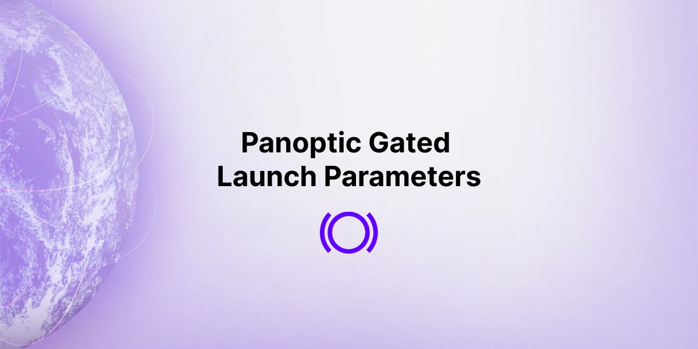
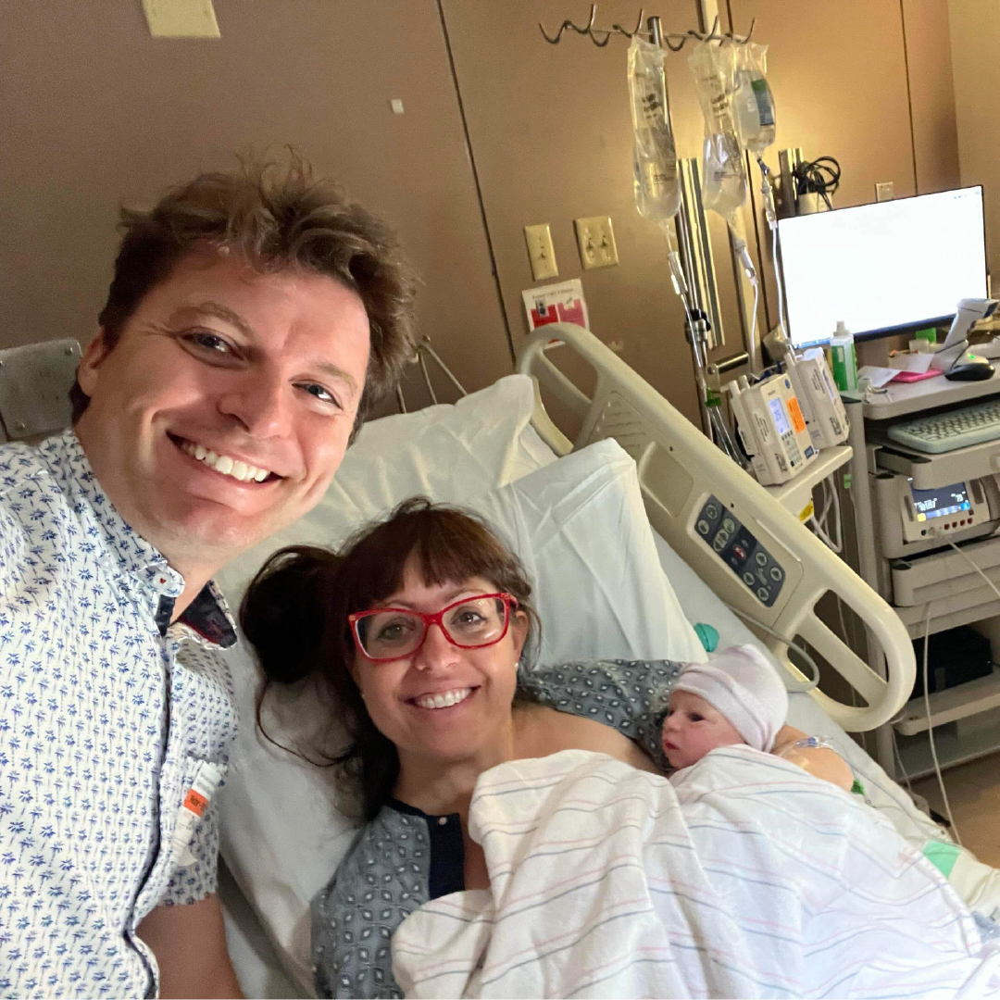

With more than 4,000 users already signed up, we’re excited by our approaching gated, beta launch. Presently our team is hard at work to ensure we do our due diligence to deliver a secure and optimized experience for all participants.

  
Our [beta launch](https://panoptic.xyz/blog/gated-launch-sign-up) is structured as multiple epochs, or rounds, of trading competitions where participants can use real assets to buy and sell DeFi-native options. In each epoch, the lowest ranking performers run the risk of being excluded from future competitions, and top performers will receive prizes. Throughout the beta launch we’re offering $100,000 in prizes.

<!--truncate-->
  
If you haven’t signed up yet, there’s still time! Sign up [now](http://signup.panoptic.xyz).  
  

## Platform Development Update

  

We initially targeted July for our launch date; however, we’ve taken some extra time to make sure we’re not rushing through any part of the platform’s development process. Our target launch date is now in August.

  

At this moment, we are finalizing our smart contract audit with [OpenZeppelin](https://panoptic.xyz/blog/openzeppelin-audits-panoptic-defi-options-protocol). Upon completion, this will be the [second full audit](https://panoptic.xyz/blog/abdk-audits-panoptic-defi-protocol) of our platform. Our developers are also finishing work on the [Panoptic UI](https://panoptic.xyz/blog/demoing-panoptic-defi-options-protocol). We will provide further updates in our weekly [Discord](https://discord.gg/54EEWP6PuV) options hour.

## Pool Parameters

  

In preparation for the gated launch, traders can familiarize themselves with the protocol and associated fees by checking out our [documentation](https://panoptic.xyz/docs/intro).

  

In addition, we’ve laid out the pool parameters for our trading competition. As part of our multi-epoch beta launch, we will be testing various combinations of these parameter values to assess their safety, robustness, and fairness for a variety of tokens and market conditions.

  

During the launch, participants may provide liquidity as [Panoptic Liquidity Providers (PLPs)](https://panoptic.xyz/docs/panoptic-protocol/protocol-roles#panoptic-liquidity-providers-plps), buy options, and sell options. Users are free to perform any of these actions, and we encourage users to try out all three roles to become more familiar with and further test the platform.

  

Learn how the pool parameters affect each role.

  

### Fees:

| Pool Parameter                                                                                    | Description                                                                                                                                                                                                                                                                                                                                                                    | PLP                                                                                                                        | Buyer                                                                                 | Seller                                                                                   |
| ------------------------------------------------------------------------------------------------- | ------------------------------------------------------------------------------------------------------------------------------------------------------------------------------------------------------------------------------------------------------------------------------------------------------------------------------------------------------------------------------ | -------------------------------------------------------------------------------------------------------------------------- | ------------------------------------------------------------------------------------- | ---------------------------------------------------------------------------------------- |
| [Commission fee](https://panoptic.xyz/docs/panoptic-protocol/commission)                          | The fixed percent fee charged to buyers and sellers for opening a position. 100% of the fee is given back to Panoptic Liquidity Providers (PLPs) and there is no commission fee charged for closing a position.                                                                                                                                                                | A higher commission fee, other things equal, means higher returns to PLPs and encourages more liquidity to enter Panoptic. | A lower commission fee makes buying less costly and encourages more trading activity. | A lower commission fee makes selling less costly and encourages more trading activity.   |
| [Exercise Cost](https://panoptic.xyz/docs/panoptic-protocol/forced-exercise)                      | Given that Panoptions are expirationless, option buyers may hold their position to perpetuity. In order to prevent option sellers from becoming locked into their position forever, option sellers (or any external party) may force exercise an option buyer's position at any time for a fee.  The farther-the-money, the cheaper it is to force exercise an option position. | N/A                                                                                                                        | A higher forced exercise cost protects buyers from losing their positions.            | A lower forced exercise cost makes it easier for sellers to recoup their locked capital. |
| In-the-money (ITM) spread fee                                                                     | This parameter compensates Panoptic Liquidity Providers (PLPs) for the extra risk that deep ITM positions have and is charged on the intrinsic value of opening a long/short position.                                                                                                                                                                                         | A higher ITM spread fee further compensates PLPs.                                                                          | A lower ITM spread fee encourages more buying.                                        | A lower ITM spread fee encourages more selling.                                          |
| [Vegoid](https://panoptic.xyz/docs/panoptic-protocol/premium#net-gross-and-owed-fees-with-spread) | This is a vega-like variable that acts as an input into the calculation for the [liquidity spread multiplier](https://panoptic.xyz/docs/faq/#fees).                                                                                                                                                                                                                            | N/A                                                                                                                        | A higher vegoid results in a lower spread, favoring options buyers.                   | A lower vegoid results in a higher spread, favoring options sellers.                     |

### Collateral Requirements:

| Pool Parameter                                                                                                                   | Description                                                                                                                                                                                                                        | PLP                                                                                                                                                                                                                                         | Buyer                                                                                     | Seller                                                                                     |
| -------------------------------------------------------------------------------------------------------------------------------- | ---------------------------------------------------------------------------------------------------------------------------------------------------------------------------------------------------------------------------------- | ------------------------------------------------------------------------------------------------------------------------------------------------------------------------------------------------------------------------------------------- | ----------------------------------------------------------------------------------------- | ------------------------------------------------------------------------------------------ |
| [Maintenance Margin Requirement](https://panoptic.xyz/docs/panoptic-protocol/liquidations#maintenance-margin-requirement)        | The required proportion of collateral to position value that must consistently be maintained to avoid liquidation.                                                                                                                 | A higher maintenance margin requirement protects Panoptic Liquidity Providers (PLPs) from potential protocol loss due to late liquidations. | A lower maintenance margin requirement improves the capital efficiency of options buyers. | A lower maintenance margin requirement improves the capital efficiency of options sellers. |
| [Sell Collateral Ratio (SCR)](https://panoptic.xyz/docs/panoptic-protocol/buying-power#buying-power-requirement-selling-options) | The initial collateral requirement to open a short option position. This determines the effective leverage of the initial option sold.  The SCR increases linearly from the set SCR to 100% between the target and saturated PUs.   | A higher SCR protects PLPs from risk of protocol loss.                                                                                                                                                                                      | N/A                                                                                       | A lower SCR increases capital efficiency for options sellers.                              |
| [Buy Collateral Ratio (BCR)](https://panoptic.xyz/docs/panoptic-protocol/buying-power#buying-power-requirement-buying-options)   | The initial collateral requirement to open a long option position. This determines the effective leverage of the initial option bought.  The BCR decreases linearly from the set BCR to BCR/2 between the target and saturated PUs. | A higher buy collateral ratio protects PLPs from risk of protocol loss.                                                                                                                                                                     | A lower buy collateral ratio increases capital efficiency for options buyers.             | N/A                                                                                        |

### Pool Utilization (PU):

| Pool Parameter                                                                              | Description                                                                                                                                                                                                                                        | PLP | Buyer                                                                                                                                               | Seller                                                                                                                                                |
| ------------------------------------------------------------------------------------------------- | ------------------------------------------------------------------------------------------------------------------------------------------------------------------------------------------------------------------------------------------------------------------------------------------------------------------------------------------------------------------------------ | -------------------------------------------------------------------------------------------------------------------------- | ------------------------------------------------------------------------------------- | ---------------------------------------------------------------------------------------- |
| [Pool Utilization (PU)](https://panoptic.xyz/docs/panoptic-protocol/specs#pool-utilization) | The proportion of Panoptic liquidity used to sell options.  Note that PU is not a parameter; we define it here for context.                                                                                                                                                                                         | N/A | A lower PU means many options were bought (or not sold).                                                                                            | A higher PU means many options were sold.                                                                                                             |
| Target Pool Utilization                                                                     | The ideal PU that is targeted through [collateral requirements](https://panoptic.xyz/docs/panoptic-protocol/buying-power).                                                                                                                         | N/A | A lower target PU means the ideal state should consist of more options buying.                                                                      | A higher target PU means the ideal state should consist of more options selling.                                                                      |
| Saturated Pool Utilization                                                                  | A threshold PU that is designated as overuse of Panoptic liquidity (too much option selling). Maintaining a PU below the saturated PU is incentivized through [collateral requirements](https://panoptic.xyz/docs/panoptic-protocol/buying-power). | N/A | A higher saturated PU means low collateral requirements kick in later, while a lower saturated PU means low collateral requirements kick in sooner. | A higher saturated PU means high collateral requirements kick in later, while a lower saturated PU means high collateral requirements kick in sooner. |

Choosing values for each parameter has its tradeoffs, as lower or higher values can favor buyers, sellers, or liquidity providers in Panoptic. With this information, start thinking about potential strategies you may want to execute in different conditions.

  

Stay tuned for more details regarding our first epoch in the Panoptic beta launch!

## Team Update

  

We have a new team member — please welcome Victoria Lambert! Congratulations to our CEO Guillaume Lambert on the newest addition to his family!  
  

  
*Join the growing community of Panotimists and be the first to hear our latest updates by following us on our [social media platforms](https://links.panoptic.xyz/all). To learn more about Panoptic and all things DeFi options, check out our [docs](https://panoptic.xyz/docs/intro) and head to our [website](https://panoptic.xyz/).*