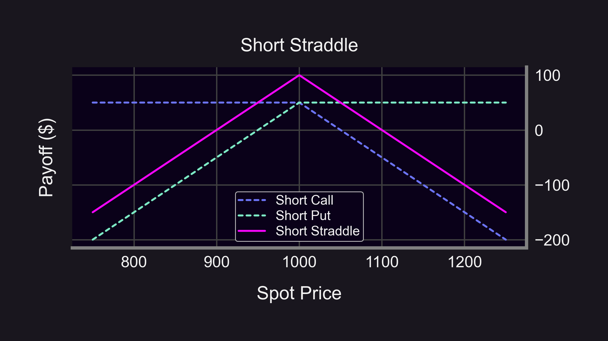

Maximizing your potential returns with minimal capital? 💰 It's not magic, it's capital efficiency! 🔮

💪📈 We’ll discuss 4 options strategies that can help you make more money with less capital:

<blockquote class="twitter-tweet" data-conversation="none">
Which of the 4 options selling strategies is the MOST capital efficient?
&mdash; Panoptic (@Panoptic_xyz) <a href="https://twitter.com/Panoptic_xyz/status/1643767225642532864?ref_src=twsrc%5Etfw">April 6, 2023</a></blockquote> 

<!--truncate-->

----------

### What is capital efficiency?

In options trading, it's the ability to control a maximum amount of funds with minimal capital investment. It measures how effectively you use available capital to achieve your desired trading objectives.

Sounds complicated? Don’t worry, we’ll ELI5 (🐵👑👇)!

Imagine a conveyor belt of small bananas 🍌. As the bananas 🍌 pass through the magic box 📦, they turn into GIANT bananas 💉🍌.

-   Small banana 🍌 = initial investment
    
-   GIANT banana 💉🍌 = funds you control
    
-   💉= Panoptic's collateral tracker
    

Let's look at the formula👇
 
$\text{Capital Efficiency} = \frac{(💉🍌)}{🍌}$

That is, capital efficiency is the ratio of "notional value" to collateral.

-   Collateral: Funds backing the position
    
-   Notional Value: The value a position controls
    

(Both of these differ from "option value", which is the premia)

In Panoptic:

-   _Sellers_ get up to 5x leverage
    
-   _Buyers_ get up to 10x leverage
    

In other words:

-   _Selling_ a 1 ETH option requires 0.2 ETH in collateral
    
-   _Buying_ a 1 ETH option requires 0.1 ETH in collateral
    

So which strategy is most efficient? Let's find out!

----------

### Strategy #1 - Naked Call

Naked calls 🙈📞 are pretty efficient...Naked Call 🙈📞 = sell 1 call:

<blockquote class="twitter-tweet" data-conversation="none">
2/14 💰 Selling call options gives you the ability to earn premium income.  But if you sell a naked (unhedged) call, you&#39;re taking on unlimited risk since you&#39;re obligated to sell the underlying asset at a preferential price if the buyer exercises the option. <a href="https://t.co/FrNnDLzcMh">pic.twitter.com/FrNnDLzcMh</a>
&mdash; Panoptic (@Panoptic_xyz) <a href="https://twitter.com/Panoptic_xyz/status/1641834029581492225?ref_src=twsrc%5Etfw">March 31, 2023</a></blockquote> 

-   Collateral: 0.2 ETH
    
-   Notional Value: 1 ETH
    
-   → Capital Efficiency: 5x 😁
    

That's very capital efficient 😁, but also risky 😳: naked calls have infinite risk 💀

Let's compare with covered calls!

### Strategy #2 - Covered Call

Covered Call 🛌🏻📞 = sell 1 call + hold asset:

<blockquote class="twitter-tweet" data-conversation="none">
4/14 The payoff of selling a covered call is the same as a naked put.  (Bonus point: covered call = naked put = Uniswap LP 🤯) <a href="https://t.co/1d7xAO8pVr">pic.twitter.com/1d7xAO8pVr</a>
&mdash; Panoptic (@Panoptic_xyz) <a href="https://twitter.com/Panoptic_xyz/status/1641834042512543745?ref_src=twsrc%5Etfw">March 31, 2023</a></blockquote> 

-   Collateral: 1 ETH
    
-   Notional Value: 1 ETH
    
-   → Capital Efficiency: 1x 😔
    

Covered calls require you to hold the full amount of the underlying asset, so it won't be as efficient.

Let's try the "Poor Man's Covered Call"!

### Strategy #3 - Poor Man’s Covered Call

Poor Man's Covered Call (PMCC) ↗️🧈 is a synthetic covered call. It's like a covered call, but you don't need to hold the underlying asset. PMCC ↗️🧈 = sell 1 call + buy 1 call:

<blockquote class="twitter-tweet" data-conversation="none">
17/25 A variation of 📅🧈 is the &quot;diagonal spread&quot; ↗️🧈  Also called a &quot;Poor Man&#39;s Covered call&quot; — useful when you expect minor price movement.  Limited upside 😋 Limited downside 😋 Bullish ⬆️  Long long-term call + short short-term call (different strikes) <a href="https://t.co/zoj4CKVJUK">pic.twitter.com/zoj4CKVJUK</a>
&mdash; Panoptic (@Panoptic_xyz) <a href="https://twitter.com/Panoptic_xyz/status/1628530324262223872?ref_src=twsrc%5Etfw">February 22, 2023</a></blockquote> 

-   Collateral: 0.2 ETH + ~0.1 ETH
    
-   Notional Value: 2 ETH
    
-   → Capital Efficiency: ~6.66x 😍
    

(Note: the collateral for buying the call is slightly larger than 0.1 ETH. This is because there is an “in-the-money amount” that is equal to the max loss the long position can suffer in terms of intrinsic value. Hence, the capital efficiency will be slightly less than 6.66x.)

### Strategy #4 - Short Straddle

Selling straddles is a bet against volatility. Can straddles beat the previous 6.66x efficiency? Straddle 🤸🏽‍♂️ = sell 1 call + sell 1 put:

-   Collateral: 0.2 ETH + 0 ETH
    
-   Notional Value: 2 ETH
    
-   → Capital Efficiency: 10x 🤪
    

Wow, 10x efficiency is the most! Why's that? Straddles are made up of 2 legs: 1 call & 1 put. Only one leg can be “tested” at any given time, i.e. if the put is ITM then the call is OTM, and vice versa. Hence, collateral req. for selling straddles is relaxed to just the req. of one leg (whichever is larger). 🤯

<blockquote class="twitter-tweet" data-conversation="none">
Cool fact about capital efficiency which will be implemented in <a href="https://twitter.com/Panoptic_xyz?ref_src=twsrc%5Etfw">@Panoptic_xyz</a>  Collateral for selling options on <a href="https://twitter.com/search?q=%24SPY&amp;src=ctag&amp;ref_src=twsrc%5Etfw">$SPY</a>:  -25∆ put=$5800  -25∆ call=$5900  -Strangle=25∆ put + call =$5960  Why not 2x larger? Only one side can be ITM at a time, so no extra risk for adding 2nd leg!
&mdash; Guillaume Lambert | lambert.eth | 🦇🔊 (@guil_lambert) <a href="https://twitter.com/guil_lambert/status/1593370796650545153?ref_src=twsrc%5Etfw">November 17, 2022</a></blockquote> 

----------

## Summary

In order of capital efficiency:

1.  Straddle
    
2.  Poor Man's Covered Call
    
3.  Naked Call
    
4.  Covered Call
    

Caveats:

-   Collateral requirements above assume normal market conditions ("target pool utilization")
    
-   See more [here](https://docs.panoptic.xyz/docs/panoptic-protocol/buying-power)
    

For more examples of capital efficient strategies and Options Trading 101 basics, visit [here](https://docs.panoptic.xyz/docs/trading/capital-efficiency).

Question:

-   How well do DeFi straddles perform? (Future #ResearchBites 😉)
    

Disclaimer:

-   📢 None of this should be taken as financial advice.