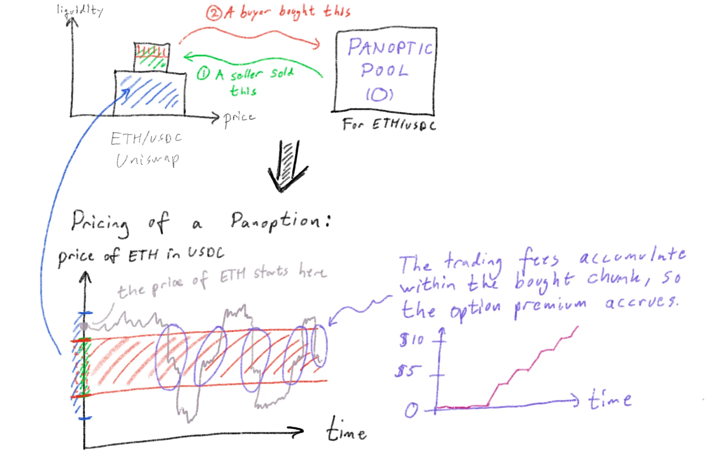
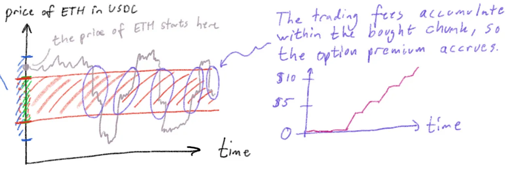
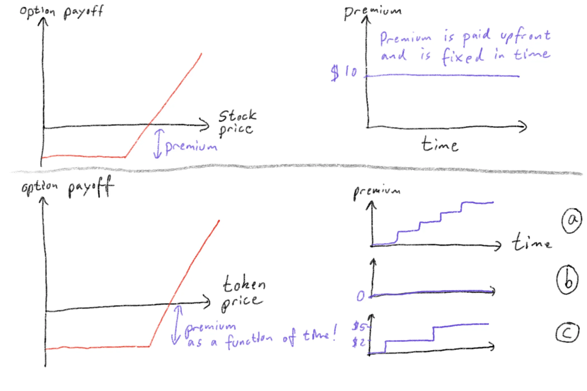
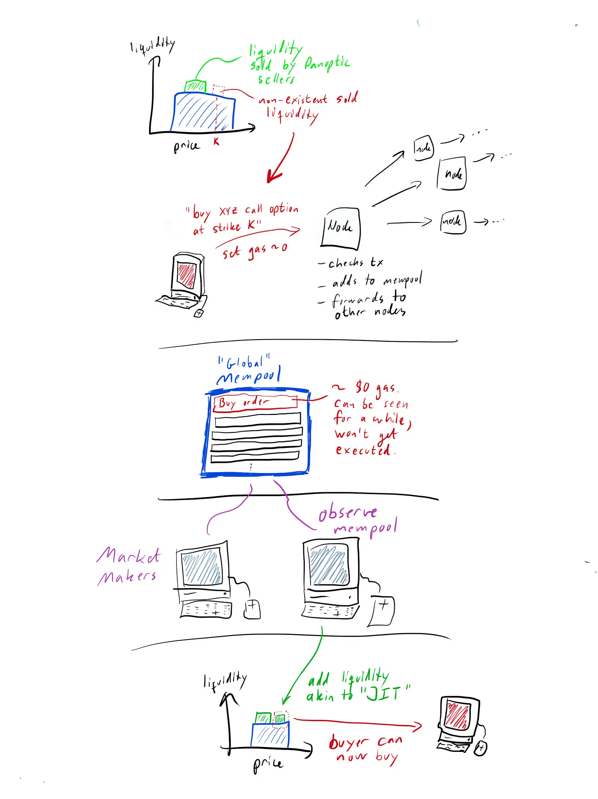
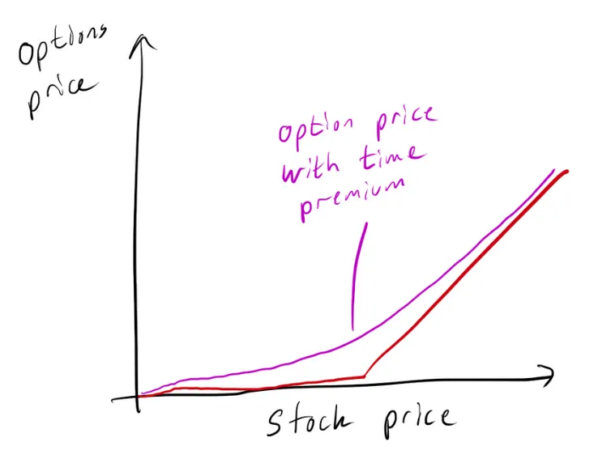
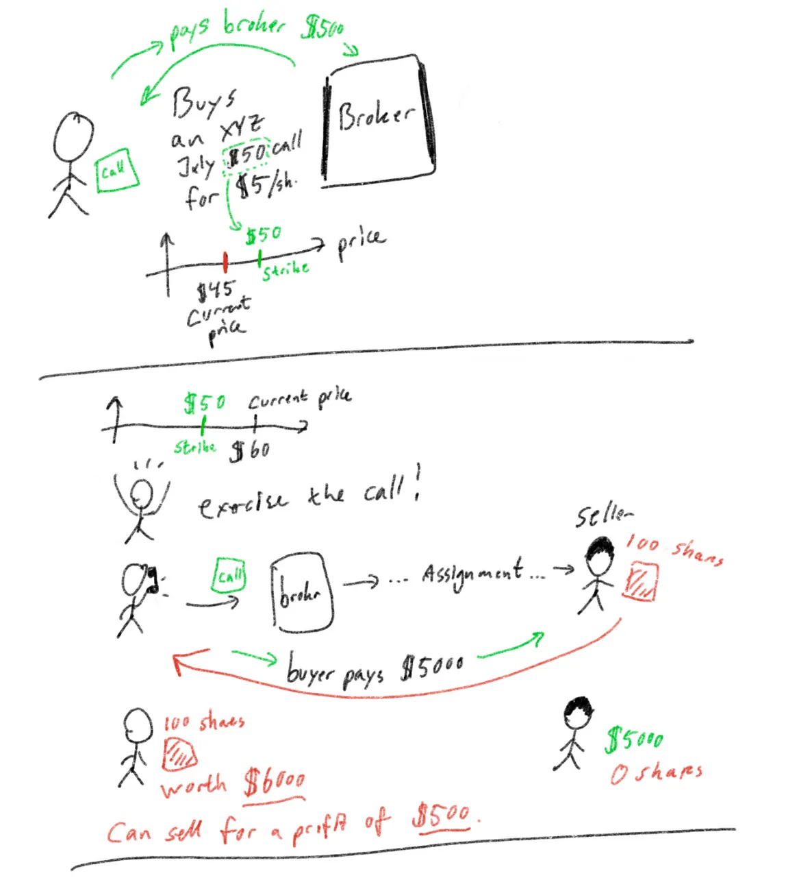
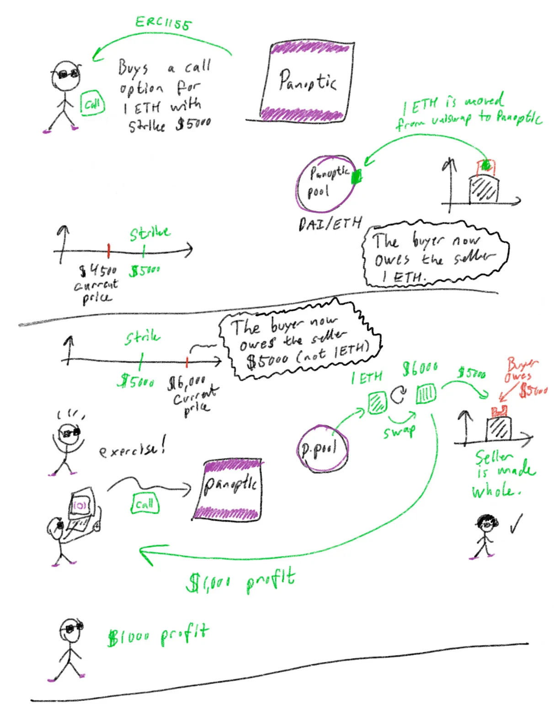
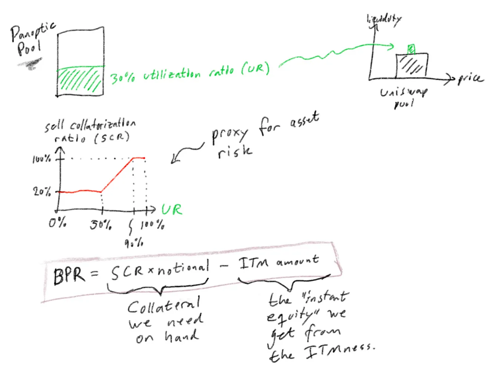
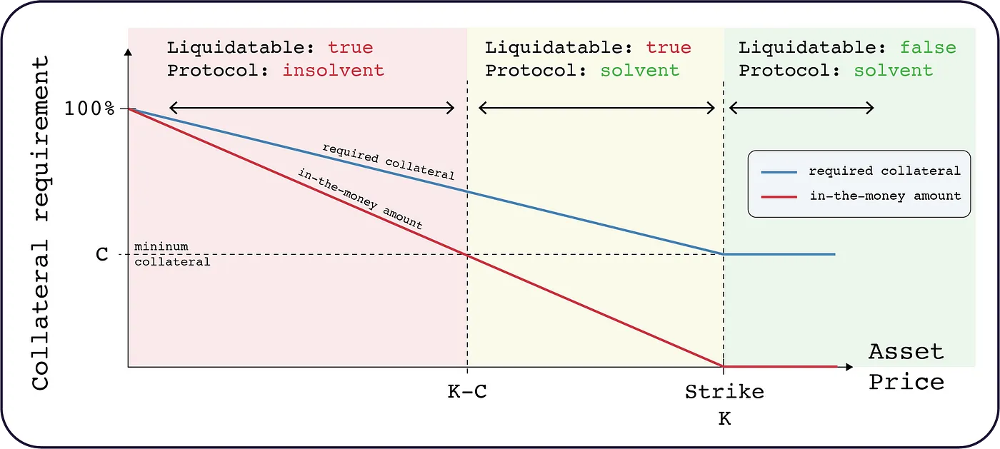

This blog post is the first in a series on options trading strategies. The series is based on the book “Options as a Strategic Investment” by McMillan.

Since 1973, when they were first used in Legacy Finance (aka Traditional Finance, TradFi),  _listed_  options markets have opened up new ways to invest.

Panoptic brings this world to the burgeoning new decentralized finance space (DeFi).

Panoptic is the automobile of options to legacy finance’s horse. It’s a powerful tool that can enhance human capabilities, bringing them to new heights. Panoptic leans into the future and embraces change for the better.

We'll talk about some specifics and subtleties of trading TradFi options and compare them to Panoptic as we go along.


Panoptic is built on and protected by elliptic curve cryptography. This is an AI-generated image of something resembling an elliptic curve. Not quite the one used, but it looks cool.

_Caveat Emptor_  
I’m writing this at a time when we are still heads-down building Panoptic on all fronts. Some details can change until we launch, but the majority and gist of my comparisons will stay the same. This post will cover how the protocol currently looks and works 👇

## The TL;DR

I hope this post will help you review (or learn) the basics of options trading and also how options trading in the legacy system compares to the new decentralized world.

In this post, I will dive into option definitions in general. This is to lay the foundation for follow-up posts discussing specific strategies. For example, we will look at how call option strategies work, and puts, etc. But before we can cover those posts, we need the fundamentals in place first. That’s the purpose of this first post.

So we will learn things like “what is a call option,” and some basics around “the Greeks” of options. I will cover, in each section, a main topic involved with options trading; for example, how does margining work, how does exercising an option work, and so on.

As we go along in the posts (and the ones to follow), I will also compare TradFi and Panoptic to better understand how the two map between each other and what we improve with our new technology.

## **Options Trading — Elementary Definitions**

Let’s first get some basic definitions out of the way.

An option is a financial contract that gives the buyer the right, but not the obligation, to buy or sell an underlying asset at a predetermined price (strike price) on or before a specified date. The underlying asset can be a stock, bond, commodity, currency, or any other asset class.

There are two types of options: call options and put options. A call option gives the buyer the right to buy the underlying asset at the strike price, while a put option gives the buyer the right to sell the underlying asset at the strike price.

The price of an option, known as the premium, is determined by factors such as the price of the underlying asset, the strike price, the time remaining until expiration, and the volatility of the underlying asset. Options can be used to speculate or protect against risk, and investors and traders often trade them on exchanges.

These definitions will almost entirely carry over to DeFi and Panoptic, but there will be differences, and I will call them out as we meet them.

Four specifications each uniquely describe an option:

1.  The type can be a put or a call. In addition, we can buy a put or a call. We can also sell a put or a call.
2.  The underlying stock/token name
3.  The expiration date (for Panoptic there’s no expiration date), and
4.  The striking (or strike) price.

A “July 50 call” is an option to buy (call) 100 shares (that is the typical contract size in TradFi) of the underlying XYZ stock (e.g., Apple) for $50/share. The option expires in July. The cost of an option is listed on a per-share basis. So if it costs $5, the total cost to the investor would be $5 times 100 = $500 to purchase the option. It’s like an insurance contract: You’re not paying right now to buy all 100 shares. You’re only buying the right to lock in a favorable price now in case the price ever reaches that level or beyond.

Generally, an options contract is 100 shares (in some edge cases, it could technically be a different number).  _This also makes it expensive for retail to buy options and creates a more exclusive market_. For example, Tesla is trading near $200 now. To buy a covered call, we’d need to purchase 100 shares as part of the transaction, costing $20,000. This is out of reach for many.

For Panoptic, we don’t have this requirement. The contract size is not fixed and can be any number. This unlocks options for a much broader population. We will pair this with strong educational content under our upcoming “Panoptic Academy” to make sure that people understand how to manage risks and keep their wealth.

Anyone who buys the option is called the holder. The seller of the option is called the writer. The writer is referred to as being short the option contract. This terminology, by the way, dates back to the “over-the-counter” (OTC) days (before the listings in 1973 mentioned in the introduction). Someone had to physically write the option for someone to then take and hold. We’re still using these names today.

Panoptic will use these terms too, and so it reminds me of [this](http://www.spikesys.com/Trains/st_gauge.html?source=post_page-----db07a48be2c7--------------------------------).

## **In- and Out-of-the-Money (the Option’s “Moneyness”)**

A call option is in-the-money when the underlying token price is higher than the strike price. Conversely, a call option is out-of-the-money when the underlying token is selling at a lower rate than the strike price. This means that if the call option’s strike price is $10 and a token is trading at $11, then the call option would be ‘in-the-money’ by $1. However, if the token is trading at $8, then the call option would be ‘out-of-the money’ by $2. Thus, one can think of ‘in -the-money’ as meaning more money for the buyer of a call option while ‘out -of -the -money’ implies less money of a payoff for buyers of a call option.

Put options behave the opposite: they are out-of-the-money when the token price is above the option’s strike price and in-the-money when the token price is below the option’s strike price.

This can be considered an attribute of the option and is called “moneyness.” This, of course, still holds in Panoptic.

## **The Premium of an Option**

This is the price the option sells for. The intrinsic value of a call option is the difference between the strike price and the stock price. There is no intrinsic value if the stock price is less than or equal to the strike price (for a call option, which we generally refer to here). But the option can still have a premium — options have intrinsic + extrinsic value.

This premium is referred to as the “call time value premium.” This time premium is generally present at any price as long as time remains (i.e., the option has not expired yet).

For example, let’s say that XYZ trades at $50, and there is a call option with the properties “July XYZ $50 Call trading at $1.” We see that the option has a cost. But if the stock trades at $50, why not just buy that? Why buy an option for $1 per share ($100 total since there are 100 shares in an options contract) when the option is also at $50? Let’s keep diving:

## **Capital Efficiency**

The reason is that our returns will be higher on the capital we lock up to buy the option than the stock outright. You pay only $100 for the right to buy XYZ at $50 in the future (until the option expires). If the stock drops, don’t exercise the option (but you lost 100% of your initial small investment of $100); if the stock increases in price to, say, $60, exercise the option you have, and you are now allowed to buy the stock at the previous lower price of $50. If you did all this without an option, you would need to shell out $5,000 upfront instead of the $100. Capital efficiency in TradFi comes with a cost: the option might expire worthless. On the other hand, Panoptic has no expiration, which could sometimes be more beneficial!

Instead, with the option route, you can take the remaining $1,800 and invest somewhere else. A put option on Shiba Inu, you say? You can do this soon via Panoptic.

Capital efficiency is also at the core of Panoptic: You can buy and sell options on margin. Thus, instead of buying 1 ETH, e.g., for $1,900, you can buy a call panoption at, say, strike $1,900 but pay $0 upfront (besides your margin requirement; that’s the same as TradFi). We will get into how the option is priced in Panoptic, but upfront, the cost is $0 on the option premium itself. This means you will take part in the full upside of 1 ETH, but you will have paid next to nothing for this 🤯.

There will be a commission on the option (not the premium, but a fixed commission when opening the position) in Panoptic, which will be given to the Panoptic liquidity providers — the community. In TradFi, they are given to the opaque system of elite operators. We will cover commissions later on.

The cost of the option after you purchase it will depend on the price path of ether. We will cover this later, and we call this our novel “Streaming pricing model.”

Back to TradFi, an option's “time premium” is somewhat a misnomer since it seems to say that this part of an option’s premium is entirely due to the time left — which isn’t quite true (volatility has a lot to do with it, e.g.).

## **Parity**

An option is at parity (at par) with the underlying stock if it trades at its intrinsic value. This is different in Panoptic. For example, in TradFi, if XYZ trades at $50 and the July $45 call option trades at $5, the option is at par because the call option is in-the-money (the stock price is higher than the strike price), and you are paying the exact difference between $50 and $45 as the premium (the $5). In general, the option could trade at other values and thus, yes, you guessed it,  _not_  be at par.

In Panoptic, the option premium is always $0 upfront. So there is no obvious definition of parity. This, of course, does not matter and has no effect.

## **Premiums in Panoptic — How much do Panoptions cost?**

In Panoptic, the premium is paid by the buyer (the holder) to the seller (the writer) in a new unique DeFi-native way. It is based on realized volatility and the fees collected in Uniswap (generally, the underlying DEX). In other words, there won’t be options listed at various prices/premiums, but rather Panoptions start at a $0 premium, and the premium accrues from there based on what the price and trading activity does in the underlying DEX.


Let’s break down this figure. I’m glad I did not pursue art. I will spell out what all the text says as well. The figure has two plots. The top plot shows a Uniswap ETH/USDC pool with some liquidity (the blue region). On top of this Uniswap pool, someone created the corresponding Panoptic pool for this trading pair. Anyone can create a Panoptic pool. Also, to be sure, anyone can buy and sell options! This pool is the square to the right. A seller in Panoptic has moved some liquidity to Uniswap (the Panoptic protocol does the movement and controls the liquidity — that is to say: the participants in Panoptic, both buyer and seller, can’t just run off with funds!) by selling an option — that’s the green liquidity shown on top of the existing blue liquidity. Panoptic controls the green liquidity, and it sits in Uniswap — so the Panoptic protocol itself, technically speaking, becomes an LP in Uniswap by depositing the green liquidity from the seller. The blue liquidity belongs to the Uniswap LPs.

Notice that, depending on if the seller sold an option on margin, the green liquidity will be a mix of funds deposited by the seller (the margin requirement) and existing funds from other Panoptic LPs (PLPs) (not shown, but is part of the Panoptic pool). So the green chunk belongs to a mix of Panoptic LPs and the seller (the seller can borrow funds from the Panoptic LPs).

When a buyer comes along, they move a chunk of the seller’s liquidity back to the Panoptic pool (the red chunk, a  _subset_  of the seller’s green chunk). This chunk is added to the “general fungible pool of funds” in the Panoptic pool — so it can be re-used into Uniswap.

At this point, I want to stop and explain more about the green chunk. I said this was from a seller. That is correct, but multiple sellers can build up the chunk. So for the same strike, width, and type of option (put/call) (which all define the green chunk), there can be multiple sellers at once, all bundling their liquidity together (like LPs in Uniswap would). Each individual seller can always get their exact share of the total green chunk using  `balanceOf(...)`  — that’s because technically, we represent Panoptic positions in an ERC1155, which is 30% more gas-efficient than using an ERC721 to represent each position and allows us to represent up to 4-legged positions via encodings in its  `tokenId`. But every time a new seller adds more liquidity to that chunk, it simply means more options can be bought. The buyer does not care about being tied 1:1 to a seller (and in TradFi, this 1:1 tie also does not exist); we will talk about  _assignment_  later on.

We learn that the Panoptic smart contracts ensure nobody can run off with funds without properly closing out their options contracts. In this way, all users of Panoptic always stay in full control of their funds with full transparency, but to engage in contracts with others, Panoptic acts as an advanced escrow account (trust the code, not people) — just like most other protocols.

Let’s look at the figure again:



The bottom plot now shows the price on the y-axis. So the graph from the top half is rotated 90° clockwise. We are not showing the liquidity as rectangles in the same way anymore but rather, we delineate their ranges on the y-axis as marks (you see the blue Uniswap liquidity shown across the vertical price axis and the smaller red liquidity chunk taken out by the buyer).

When the buyer removes liquidity from the seller(s) (the red chunk is a subset of the green chunk, and the red chunk moves out of Uniswap — by burning the seller’s LP tokens, thus recovering the underlying tokens), Panoptic will still keep track of the bookkeeping: The buyer will owe the seller all the fees that the seller would have collected if the buyer had not taken out the chunk. So, in a sense, the red chunk is still “present” in Uniswap from a Panoptic accounting perspective. The fees will still be collected by the seller as if it was there; Panoptic is just handling this now instead of Uniswap, ensuring that the seller now gets the fees from the buyer specifically.

Notice here that we can redefine the amount of fees received by the seller from the buyer. We could say that the seller gets 10% more fees than if they had purely LP’d into Uniswap. Currently, the rate is 1:1 with Uniswap.

From the seller’s perspective, they always earn exactly the amount of fees — in fact, more fees, but we will get to that soon — that the entire green chunk entitles them to. It’s  _not_  that because the buyer shows up, they earn “the green  _minus_  the red chunk” of fees. There’s also an analogy between an options seller in Panoptic and an LP in Uniswap because they deposit funds into the Uniswap pool. But a seller in Panoptic earns ≥ yield of a Uniswap LP.

As a side note, there’s also a loose analogy between a Panoptic LP and a Uniswap  _v2_  LP (the fungible version) in that the Panoptic LP provides passive fungible liquidity into the Panoptic pool. But there are added benefits: Single-sided liquidity can be provided in Panoptic. And yields are based on the options trading volume, which could be larger than spot in the future.

> So what exactly does the seller earn in fees? In Panoptic, this question is the same as asking: what is the option premium paid by the buyer?

(we will dive into this 1:1 relation more later) We can show that if we now put time on the x-axis. And we can visually show the red chunk as being in the same spot for all time as it would be:



Let the price of ETH be shown in gray, and assume it starts at some point (shown at time=0 on the left graph) at  `t=0`. The price moves via swapping activity in the Uniswap pool. At some point, perhaps the price crosses the red chunk, or, more technically precise: crosses the area where the red chunk was removed from, but because the buyer will still reimburse the seller (via Panoptic), we can think of the red chunk as collecting fees for the seller, and the buyer is paying that fee.

The seller of course still collects fees from Uniswap as per usual from their green chunk.

But if the red region “received” trading activity, the buyer will owe the seller money, which will accrue over time (whenever the price is within said region), this is shown to the right where the premium curve increases during the highlighted purple circles in the left plot.

As mentioned, this becomes the option cost/premium for the buyer: The amount of fees that the red chunk collects in Uniswap (and again: because the red chunk is not physically present in Uniswap, Panoptic settles this automatically between the buyer and seller). Note that, of course, the price could never touch the red chunk, in which case, the option cost to the buyer is zero!

## **Panoptic solves DeFi’s liquidity fragmentation problem**

Let’s pause for one second and ask: Does the blue liquidity in Uniswap — owned by Uniswap LPs — benefit Panoptic? At first sight, it seems like no.


But the answer is a strong yes. The blue liquidity is extremely helpful to Panoptic, because we use this to achieve a better option price and general stability (deeper pool, similar to how a deeper order book in TradFi leads to less market movement against incoming orders, which is good for traders).

We still work on longer tail assets as well. In fact, in that case, Panoptic should assist in price discovery and help more people deploy liquidity into, e.g., SHIBA INU and other long-tails that are in “disequilibrium.” So Panoptic encourages more options selling, which drives down LP fees, and increases spot trading liquidity, which lowers volatility due to more liquidity padding the price movement.

> The broader point is that we are accessing and utilizing the existing $4B liquidity in Uniswap for free. We get existing Uniswap pools that we can build on top of. This gives us instant access to using our novel Panoptic streaming pricing as well.

And most importantly, as Panoptic LPs, buyers, and sellers join the system, we put liquidity back into Uniswap, increasing their volume and pool depths to improve their swapping ecosystem:

> Panoptic is designed to be a win-win

Another way to show this and summarize the comparison is with this figure:



There are two rows. The top row is a TradFi option where the premium is paid upfront based on factors including implied volatility (IV). The premium is the same throughout the option's life, shown to the right (so the overall top right figure).

Panoptic’s model is shown in the bottom row. Here, the premium is a function of time. We show three possible premium evolutions. Premium plot (a) shows Panoptic’s premium increasing over time. This happens as the price in the pool crosses the buyer’s chunk, as discussed earlier. The premium is non-decreasing since the fees collected in Uniswap from trades — and therefore the amount the buyer owes the seller — is a non-decreasing function.

Note that the premium can also stay flat at zero in Panoptic; see (b). In addition, it could rise to a given level and stay there for a long time (potentially until closing the position); see (c). This level could be less than or greater than a corresponding expiring option.

These scenarios could enable arbitrage opportunities between other options and Panoptions.

## Classes and Series

In TradFi, a  _class of options_  refers to all puts and calls on the same underlying stock. A  _series of options_  are a subset of a class and refers to all the contracts in a class having the same expiration date and strike price.

In Panoptic, you can sell whatever option you want to the market. The equivalent of a class is all the liquidity deployed to Uniswap from Panoptic. Regarding the buying demand, the way to currently signal intent to buy is to send a very low-gas transaction to the mempool. This way, a seller/market maker would see this and sell the option for the buyer to purchase. These transactions should be included in the class. Over time, we will build this out further in Panoptic. This can represent multiple different strikes. In Panoptic, multiple sellers can deploy liquidity to the same strike price. This would constitute a series of options.



This is how it would work: A buyer wants to buy at a strike not available/listed. They send a low-gas transaction (tx) to his node (via Metamask, e.g.) with the details to buy at the given strike. The node confirms the transaction and adds to the mempool. Then, the tx is forwarded to other nodes. After a few seconds, essentially every node’s local mempool is updated to include the tx across the globe. Let’s imagine a global mempool. Such a concept does not exist, but the point is that we imagine the tx being present in each node’s local mempool and visually represent it as a global mempool. Market makers monitor the mempool and see the tx. They sell the corresponding Panoption and the buyer can now purchase it.

This can, of course, be expanded into an off-chain order-book style system, and we would still settle on-chain via Panoptic.

## **What influences the price of an option?**

Back to our general options discussion, the major factors influencing the price of an option are:

1.  the price of the underlying stock
2.  the strike price of the option itself
3.  the time remaining until the expiration of the option
4.  the volatility of the underlying stock
5.  the risk-free interest rate
6.  the dividend rate of the underlying stock.

The first four of these items are the major factors. In Panoptic, the options are perpetual with no expiration date, so bullet three does not apply because there is no expiration.

The price of the underlying stock — or cryptocurrency — is the main influence on the option premium.

For a call option, the option price at expiration versus the underlying stock price looks like this graph, which you might have seen before:


Why do we say “at expiration” and not “option price versus stock price”? The time value premium of the option is in effect when the option has not yet expired; let’s look at what an unexpired option generally looks like:



In general, we get the time value premium from:

Time value premium = Option (Call) price + Strike price - stock price.

We need to account generally for a time value premium being present when pricing options. The time premium is the highest, where the strike price equals the stock price. Options expiring further into the future have higher time premium value compared to similar options expiring sooner.

## **Details about TradFi options trading**

In general, and specifically to TradFi, an options strategist needs to be concerned with the following details on options trading:

1.  Options trading can be frenetic near the end of the day. Waiting too long to place an order at the end of the day is not advisable.
2.  Options trades have a one-day settlement cycle. So the option trade settles on the following business day, in general.
3.  Options are opened for trading in rotation. So when the underlying stock opens for trading, the options on that stock go into opening rotation on the corresponding option exchange. So bids and offers and made for each particular series one at a time: The XYZ January 45 call, the XYZ January 50 call, etc. Thus, the option “opening price” can be a suspicious statistic.
4.  If the underlying stock splits, pays a dividend, or pays a special cash dividend (of some minimum size), the terms of its options are changed.
5.  Position limit and exercise limit  In TradFi, an investor cannot be long or short more than a set limit of contracts in one stock on the same side of the market.
6.  The number of contracts that can be exercised in a particular period of time is also limited to the same amount as the position limit.

We don’t inherit many of these issues in Panoptic and DeFi in general. Bullet one is irrelevant, but the closest we get is blocks being filled and one having to pay a high gas fee to be included. As the blockchain ecosystem grows, this problem will diminish, which is not true for TradFi.

Bullet two is not relevant, either. Panoptic’s options settle instantly.

Bullet three is not relevant. Panoptic is open across all options series 24/7.

Bullet four is not relevant. No central authority can change the terms of the options. The market will decide.

We don’t impose any limits from bullets five or six either. Thus, all of these nuances of the legacy system are not inherited in Panoptic.

## Exercising and Assignment

Another mechanical detail of TradFi relates to how options are exercised and assigned.

An option holder who exercises the right to buy or sell is said to exercise their option. Call option holders exercise to buy the underlying stock, whereas put holders exercise to sell the underlying stock.

A holder can exercise after taking possession of the option up until 8 pm on the last trading day. European options can be exercised only on this last day but are generally not stock options.

These exercise notices are irrevocable and cannot be canceled once submitted.

In Panoptic, there is no such concept as a limit on when you can exercise. Our options are perpetual. The buyer can exercise whenever they want to. Also, technically, an exercise tx in Panoptic can be canceled by submitting another tx with higher gas that ensures the initial tx won’t execute. The cancelation window depends entirely on the network conditions and the initial gas fee used.

When a holder exercises their right to buy (in the case of a call option), the underlying stock must be delivered to them. That would be the seller/writer of the option. This is called  _assignment_. The writer is assigned to deliver the stock.

Let’s take a closer look at this mechanism. The Options Clearing Corporation (OCC) handles the exercising and assignments of options. Here’s the general TradFi flow — but hang on to the railing:


*Takes a deep breath*  
The holder of an XYZ January 45 call wishes to exercise their right to buy the XYZ stock at $45. He instructs his broker to do so. The broker notifies the administrative section of the brokerage to do this. They, in turn, notify the OCC that they wish to exercise one contract of the XYZ January 45 call series. The OCC now finds a firm, any firm at random, that wrote such a corresponding contract. The OCC sends this firm a notice that they have been assigned. The firm finds one of its customers *checks notes* at random who is short this XYZ January 45 call. The selection is allegedly random. Some firms also employ first-in/first-out methods or some other method. As a writer, it’s critical to know how assignment works, and I guess trust that it works that way 🤷  

*Exhales*

Oh, and I’m sure that’s not better replaced by automated smart contracts /s.

We can visualize this:


That was a lot. And do we know that assignment is always fair? We have to trust our brokerage firms on that one. It feels opaque and non-inclusive.

In Panoptic, this is entirely different; it is trustless (you don’t need to trust a bank, a corporation, or anyone). Let’s first understand what it means to hold an option in Panoptic. The holder is the buyer of an option that a seller has sold. Nobody can buy a panoption without having the seller there first. The holder has the right to buy the underlying token at any time.

Let’s take an example. First, in TradFi, this is the “simplified” process:



The end result is a profit of $500 when accounting for the upfront fee — the cost of the option was $500. If we assume the cost of the option is $0, the profit is $1,000.

The financial system, however, took a bunch of small fees along the way, leaving everybody slightly worse off in most cases.

Compare now the same situation to Panoptic — where the smart contracts do the heavy lifting with no hidden costs:



The result is the same: a profit of $1000. All run by pure code supported by nodes across the globe.

> No middlemen fees or opaque execution.

As discussed, the premium is indeed $0 upfront, but the total cost is known at the time of exercise (it can be monitored at all times by the buyer) and can be more or less than that of a TradFi option.

Mathematical models can be built to estimate the expected payoff.

Importantly: with Panoptic, there were no middlemen involved. We also didn’t hand over our funds to anyone who could not be trusted. We gave funds to the code, and the strict and open-source rules ensure orderly conduct. We can also check everything on-chain for full transparency at all times. This is far from the case in Legacy Finance (TradFi).

The “seller assignment” in Panoptic works by the sellers of the green chunk of liquidity, all collectively being assigned together against the buyer (so we don’t single out a seller for assignment; it’s a group effort). The assignment is shared among all sellers at the strike, width, an option type (that 3-tuple defines a specific chunk of sold liquidity uniquely), and there are no unknown arbitrary rules behind the scenes — verify it all in the code and on-chain!

## **Buying Power**

The amount of capital available to place a trade is called the  _Buying Power._

Buying power is related to margin. Trading options on margin is much more complicated than with stocks, and each broker can have different margin requirements depending on your strategy. We won’t cover those details here.

But this concept carries naturally over to Panoptic; however, it is much simpler in our case. Sellers deposit collateral to the Panoptic pool when they want to sell an option. This gives them buying power (how much they can spend on selling a new option).

The minting of any option in Panoptic will reduce the account’s Buying Power, and the Buying Power Reduction (BPR) of an option depends on the following:

1. Notional value of that option (the value that the option controls)  
2. Price of the underlying asset  
3. Risks associated with trading the underlying assets

From points 1 and 2, it's easy to determine how much your purchasing power has decreased (see below). On the other hand, the impact of point (3) is not as clearly defined.

In TradFi, for instance, selling calls on GameStop (GME) may have a 100% collateral requirement, whereas Apple (AAPL) may only have a 20% collateral requirement. Centralized actors at each brokerage firm are the only ones who can decide to change the collateral requirement for a certain asset.

At Panoptic, the protocol looks at how the pool is used when a position is created to infer an asset's risk. The rationale is as follows: If an asset is in high demand, there will be a lot of trading activity, and most liquidity will be actively traded. This means the liquidity normally available to trade/adjust/roll positions will be reduced. Hence, it will be more difficult for traders to respond to market moves, increasing the risk for those specific pools. So, requiring more collateral from pools that are used a lot will help reduce those risks.

Let’s take a look at what this means, first from a seller’s perspective:

```
BUYING POWER REQUIREMENT (selling) =  
   SELL_COLLATERAL_RATIO * NOTIONAL_VALUE -  
   IN_THE_MONEY_AMOUNT
```

So the requirement is related to utilizing the pool (the first term) and reduced by the amount of in-the-moneyness the option is (the second term is thus zero for OTM options). Because ITMness gives instant “equity” to the writer and counts as a positive on their overall ability to repay debt (they can exercise the option and receive the ITM amount).



This figure defines the pool Utilization Ratio (UR): How much of the Panoptic pool funds are used for net selling options (buying decreases the UR because it moves funds from Uniswap back into Panoptic).

The sell collateralization ratio is how much collateral the seller needs when the UR is at a given level. A pool having high usage requires more collateral to participate in. A 100% collateralization ratio means that the seller needs to deploy as much capital to the Panoptic pool as they plan on selling as an option.

For ITM options, the ITM amount can be seen as an asset on the seller’s bottom line (since it’s “instant equity” they get), so we factor that amount into the BPR.

In Panoptic, the Buyer also has a Buying Power Requirement. It follows a similar structure as for selling:

```
BUYING POWER REQUIREMENT (buying) =  
    BUY_COLLATERAL_RATIO * NOTIONAL_VALUE +  
    IN_THE_MONEY_AMOUNT
```

For out-the-money options, the collateralization ratio for selling an option is fixed at 20% when pool utilization is less than 50% and (linearly) increases to 100% when pool utilization is 90% or more. The ITM amount is negative for in-the-money (ITM) options, and the user may see their collateral balance increase.

## Margin Trading

In traditional finance, some types of accounts such as IRA or Level 1 trading accounts require all options to be fully collateralized. Specifically, users in IRA accounts can only sell cash-secured puts or covered calls, which means they must deposit the notional value of the underlying position in cash (for cash-secured puts) or own the underlying shares (for covered calls).

Undercollateralization is handled by reducing the buying power requirement of an asset. A Level 4 trading account in a TradFi brokerage firm allows users to sell naked puts and naked calls by posting 5x less collateral than users in a Level 1 account. For portfolio margin accounts, the collateral requirements could be even smaller, requiring about 10–15x less collateral than a Level 1 account.

Panoptic makes use of built-in leverage similar to Level 4 trading accounts to enable  _the minting of undercollateralized options_. The requirements for collateral follow the rules set out by CBOE and FINRA, which — for selling put options — can be summed up as follows:

```
MaximumOf[notionalValue⋅20%, notionalValue⋅(1 − 80% Price/strike)]
```

It helps to visualize the collateral requirement  _for a short put at strike K_  compared to the in-the-money amount and the liquidation bonus in a graph:



First, recall that a put writer (the person opening the short put) offers to buy the shares from the option buyer at the strike price. So if the asset price is higher than the strike price (the option is OTM), the buyer won’t exercise. This is good for the writer.

Next, notice a minimum collateral, C (horizontal dashed line). The required collateral for the writer/seller (full blue curve) never descends below that. For a short put, the collateral required from the seller stays at the minimum for any asset price above the strike price K — because the option is OTM and this is good for the put seller, so no need to post more collateral.

When the price drops below the strike price, the option becomes ITM which is bad for the writer (because they now have to take delivery of the underlying asset at a worse price than if they just bought in the market). So the more ITM the option is — the “in-the-money amount”: red full line — the more required collateral there is for the writer (blue full line). Until the ITMness reaches 100% (aka $0 of the underlying) which means the seller needs 100% collateralization — the full worth of the underlying asset (in TradFi this would mean the full 100 shares at the strike price; in Panoptic it would mean whatever contract amount you sold times the strike price).

Notice, finally, the region where the seller’s position is liquidatable. This means anyone can liquidate the seller’s position if the seller’s deposited collateral fails to stay above the required collateral (blue line). To prevent this, the seller should closely monitor their position and deposit additional collateral as the asset price drops.

In the case of an extreme price swing or unexpected market event, a liquidation may not happen on time, and the loss to the seller may exceed their deposited collateral resulting in the protocol suffering a loss.

To mitigate this, in Panoptic, we will run a state-of-the-art liquidation network and also let the community run liquidation bots to ensure the health of the protocol.

But don’t take our word for it; we will release an official report on the analysis of our liquidation network (more details to follow).

## Commission

In TradFi, both the buyer of the stock via an exercise and the seller of the stock via the assignment are charged full stock commission on 100 shares (unless an agreement exists between the customer and the brokerage firm). The option holder incurs a higher commission in general through assignment than they do selling the option in the secondary market.

So the public customer who holds an option is better off selling the option in the secondary market than exercising the call (unless they of course want to hold the underlying stock, then it could be worth it).

We have discussed the option premium above and how Panoptions are priced based on the price movement in the underlying AMM (with a zero-cost upfront).

However, anyone opening a new position will pay a commission, which will all go to the Panoptic LPs.

Traditional brokerage firms charge a fixed commission when a position is opened  _and_  closed. And with options, no commission is paid if the user allows the option to expire. A perverse incentive of this model is that users may keep their position open longer because they do not want to pay that commission fee.

In Panoptic, since options never expire, commissions are only paid when a new position is minted. We believe this will eliminate the impact of the commission fee on the user’s decision-making process when closing a position.

In TradFi, fees vary a lot and commissions are also part of this industry, but it’s not always clear where this fee goes. Panoptic distributes the fees back to the users and participants.

The value of the commission to be paid is the commission rate multiplied by the  `notional value`  of the option (i.e., the amount of token moved to/from the Uniswap pool). Note that the commission will always be paid in terms of the  `tokentype`  of the position: it will be paid using  `token0`  for puts and  `token1`  for calls.

```
commission = (notional value) * commissionRate()
```

The commission fee starts at 60 bps when pool utilization is below 10%. The commission fee (linearly) decreases to 20 bps when pool utilization is at 50%. The commission fee remains at 20bps when pool utilization is above 50%. The commission is high at low pool utilizations to ensure that Panoptic Liquidity Providers receive a reasonable yield even if there is low trading activity. Keeping the commission rate constant above the target utilization rate of 50% also means traders will not be disincentivized to trade as market activity increases.


## Order Entry

When entering an order in TradFi many order types are acceptable (certain electronic exchanges won’t take certain order types, though).

Here are the major order types:

-   A market order is a simple order to buy or sell the option at the best possible price as soon as the order gets to the exchange.
-   Limit order: Buy or sell at a specified price — the limit.
-   Stop order: Not always valid on option exchanges, but this order becomes a market order when the security trades at or through the price specified on the order.
-   Stop-limit order: This order becomes a limit order when the specified price is reached. The difference with this and the stop order is that the stop order has to be executed as as soon as the stop price is reached, the stop-limit on the other hand may or may not be filled.
-   Good until canceled order: A limit, stop, or stop-limit order may be designated “good until canceled.” The order remains valid for 6 months without renewal if the conditions for the order are not met.

In Panoptic, we support market orders and due to the 24/7 nature of the DeFi markets, they will, in most cases, execute in the next block (on the order of 12 seconds after you send it).

We do not support the other order types, but DeFi offers  _something much better_: You can write your own custom logic and integrate with Panoptic (call our smart contracts); thus,

> Panoptic empowers you execute your order under any condition you can imagine.

## Conclusion

In this post, we covered similarities and differences between options in TradFi and Panoptic running on the Finance of the Internet. We touched on specific definitions from TradFi and compared them 1:1 with Panoptic. We saw that Panoptic improves most aspects of the outgoing system and that this novel protocol will help level the financial playing field in a new world.

*Join the growing community of Panoptimists and be the first to hear our latest updates by following us on our [social media platforms](https://links.panoptic.xyz/all). To learn more about Panoptic and all things DeFi options, check out our [docs](https://panoptic.xyz/docs/intro) and head to our [website](https://panoptic.xyz/).*