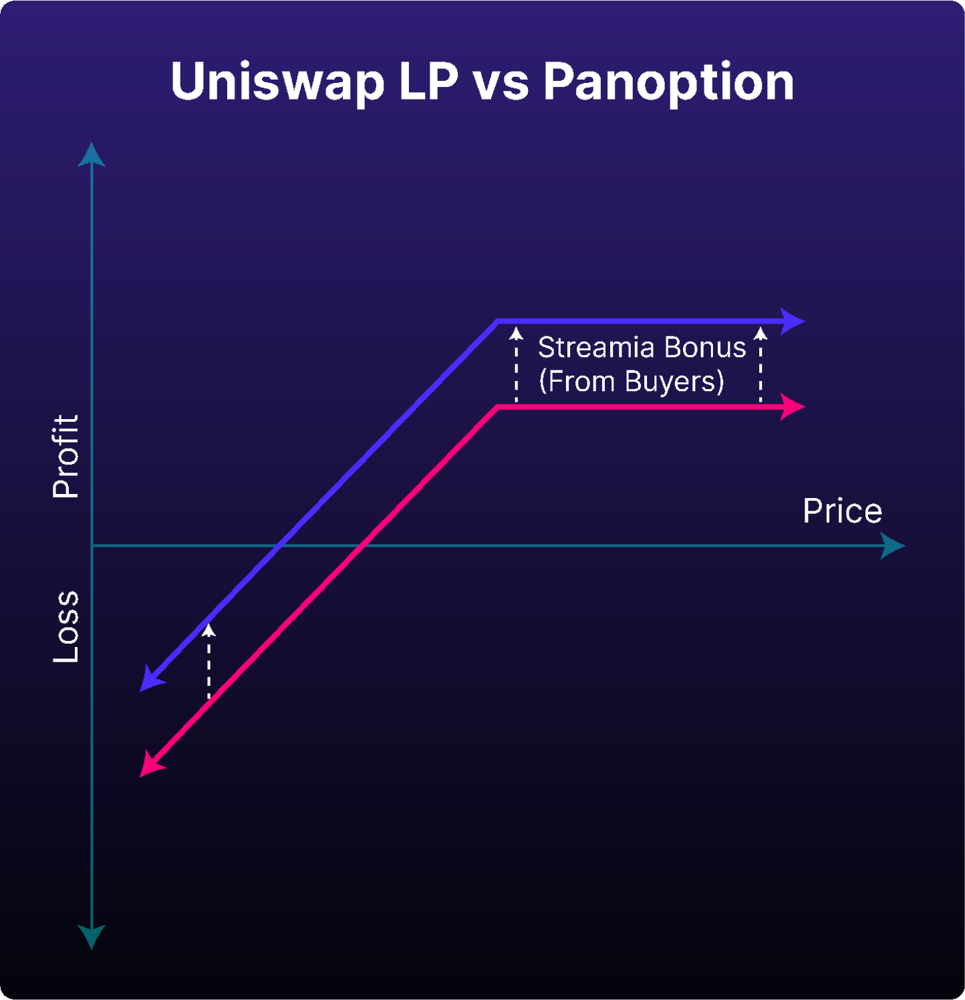
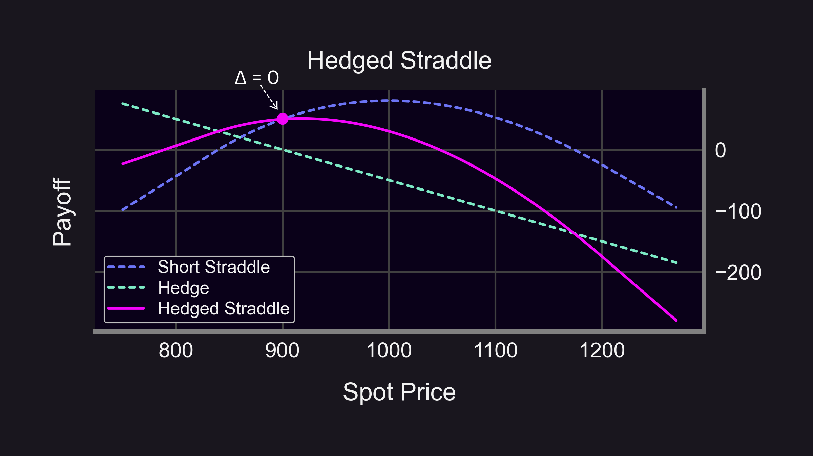

Market making is a core component of any financial system. In Panoptic, it's a unique and critical element of our platform that empowers the future of options trading by removing intermediaries, counterparty pricing, and order books.

  

To fully comprehend how market making works on Panoptic, it’s important to understand what market making is and the differences between spot and options market making. Specifically in options market making, it’s helpful to take these basic understandings and learn how to create delta neutral positions to manage risk.

  

Learn all of this and more in our primer on Panoptic market making.

<!--truncate-->

## What are Market Makers?

In traditional finance (TradFi), market makers work as intermediaries that provide liquidity to markets by simultaneously offering to both buy and sell an asset at a given price. By placing these offers known as maker orders on an order book, market makers help to increase market depth which enables potential buyers and sellers to trade more easily at a lower cost.

## Comparing Spot and Options Market Makers

  

Market makers typically specialize in either spot or option markets.

### Spot Markets  
  

Spot market makers offer to buy and sell an underlying asset. Their activities involve taking on inventory risk. Inventory risk is the potential for the value of an asset to change after it has been acquired by a market maker and before it is sold.

  

For example, if a market maker buys an asset such as Ether (ETH) and the price of the asset drops before the asset can be sold, the market maker incurs a loss. Market makers mainly profit off of the [bid-ask spread](https://panoptic.xyz/docs/terms/ask#bid-ask-spread), which is the difference between the price at which they buy ([bid](https://panoptic.xyz/docs/terms/bid)) and sell ([ask](https://panoptic.xyz/docs/terms/ask)) the asset.

  

### Option Markets

  

Options market makers focus on making offers to buy and sell options contracts. While there are still bid and ask prices, these market makers encounter different risks such as [gamma](https://panoptic.xyz/docs/terms/gamma), or the rate of change of [delta](https://panoptic.xyz/docs/terms/delta).

  

If the market moves significantly, an options market maker could face substantial losses due to gamma risk. However, similar to spot market makers, they also profit from the bid-ask spread.

  

Overall, spot and options market makers differ from each other due to the nature of the instruments, the risk involved, and the complexities of managing options portfolios.

## Market Making in Panoptic

Panoptic is a revolutionary options trading platform that introduces perpetual options to the world of decentralized finance (DeFi). Market making in Panoptic differs from both TradFi and DeFi options market making because our novel framework enables option sellers to receive [streamia](https://panoptic.xyz/blog/streamia-defi-native-options-pricing), or a streaming premium, without the presence of buyers. This enables infinite selling at any desired strike price since sellers will always be compensated.

  

Unlike traditional market making, there is no bid or ask price on Panoptic. The protocol determines the fair price based on Uniswap’s spot trading activity, eliminating the traditional bid-ask spread and replacing it with a [liquidity spread](https://panoptic.xyz/docs/panoptic-protocol/premium#net-gross-and-owed-fees-with-spread). Liquidity spreads are determined by the ratio of buyers to sellers for each perpetual option in Panoptic. Therefore, more buyers in Panoptic translates to higher streamia for sellers.

  

  

Mathmatically, the liquidity spread is defined as  
  
$1+v \cdot \frac{S}{N}$

  

where

  

-   $v$ = the protocol adjustable parameter bounded by $0 \leq v \leq 1$
    
-   $\frac{S}{N}$ = the ratio of liquidity removed from Uniswap and Panoptic-controlled liquidity in Uniswap.
    

  

From the $\frac{S}{N}$ ratio, we see that the streamia depends on the market demand of the option. If there is a significant amount of interest from buyers, that is $S$ is very large, then the streamia will be very high.

  

Overall, market makers in Panoptic primarily sell options, diverging from traditional options market makers who sell and buy options. In Panoptic, market makers face the challenge of identifying popular strike prices and [widths](https://panoptic.xyz/research/zero-dte-defi-options) to sell options with an aim to leverage the liquidity spread bonus.

## What is Delta?

Trading options inherently exposes you to delta risk. Delta measures the rate of change of an option's price with respect to a $1 change in the underlying asset's price. For instance, a delta of 0.5 for an ETH call option would imply that for every $1 change in the price of ETH, the price of the option changes by $0.5.

## Delta Neutral Trading

Delta neutrality, or zero delta, is possible through hedging your trades. Delta neutrality is achieved through a process known as delta hedging which involves constantly adjusting how much of an underlying asset you hold to offset changes in the delta of your option’s position. This type of hedging is a dynamic process that has to be continuously adjusted, especially in volatile markets due to gamma, the rate of change of delta.

## Delta Hedging Examples

One example of delta hedging is buying ETH while simultaneously shorting it to flatten your delta to zero.

  

A more complex scenario involves selling an at-the-money (ATM) ETH [straddle](https://panoptic.xyz/research/defi-option-straddle-101).

  

If the price of ETH increases, you buy more ETH to maintain a delta-neutral position.

  

  

If the price decreases, you sell ETH to maintain a delta-neutral position.

  

  

This process, known as rebalancing, is a core part of delta hedging strategies.

## Rebalancing

Triggers are typically set to routinely maintain the portfolio’s delta neutrality because each rebalancing action incurs trading fees. Triggers can be based on time passing, the price of the underlying asset changing, or the threshold amount of delta to be tolerated.

  

### Time

  

A time-based trigger would check the portfolio delta after a specified period of time has passed, such as one hour, and hedge as needed.

  

### Spot Price

  

A price-based trigger would track changes in the price of the underlying asset and hedge after large market movements. Traders can assess the general trend of the market and the gamma of their position in order to determine a maximum percent change in the spot price to tolerate before hedging.

  

For example, a trader with a long gamma position in a trending market might set a looser target of 6% in order to profit from a potential change in delta. If the trader believes the market will be more choppy than trending, the trader might tighten their target to 3% in order to secure their profits more quickly.

  

### Delta Threshold

  

A threshold-based trigger would constantly monitor the portfolio delta and hedge once a specified level is breached. For example, the [S&P 500 Delta Hedged Straddle](https://www.spglobal.com/spdji/en/indices/strategy/sp-500-delta-hedged-straddle/#overview) uses a [delta hedging threshold](https://www.spglobal.com/spdji/en/documents/methodologies/methodology-sp-delta-hedged-straddle-indices.pdf) of 0.1. As soon as the portfolio delta exceeds 0.1, S&P 500 mini futures are bought or sold in order to flatten the portfolio delta to zero.

## The Benefits of Hedging with Futures

While options can be hedged by buying or selling the underlying asset, options are typically hedged with futures contracts due their benefits of leverage and liquidity. You can learn more about futures contracts [here](https://panoptic.xyz/research/perpetual-futures-vs-options#vanilla-futures).

  

Futures contracts enable traders to control a large amount of the underlying asset with a smaller amount of capital, providing increased leverage. However, using an isolated futures account on margin to hedge can put traders at risk of liquidation even when their overall portfolio, including their options positions, is delta hedged.

  

Futures allow traders to easily establish both long and short positions, making it more straightforward to hedge a position. Futures markets are also generally more liquid and have lower transaction costs than spot markets, making them an attractive option for hedging. Additionally, futures are non-custodial so traders don’t have to hold the underlying asset.

  

In crypto, [perpetual futures](https://panoptic.xyz/research/perpetual-futures-vs-options#what-are-perps) (perps) offer added benefits of flexibility with no expiries and have the potential benefit of earning the funding fee. Perpetual options can be hedged with perpetual futures. We will further explore this concept in future research.

  

*Join the growing community of Panotimists and be the first to hear our latest updates by following us on our [social media platforms](https://links.panoptic.xyz/all). To learn more about Panoptic and all things DeFi options, check out our [docs](https://panoptic.xyz/docs/intro) and head to our [website](https://panoptic.xyz/).*